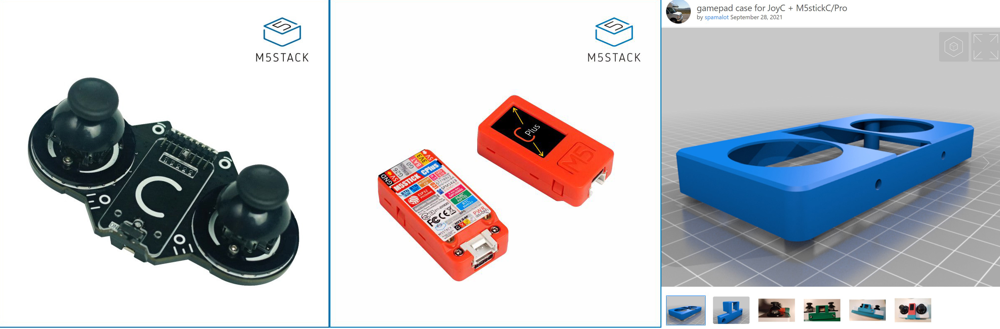
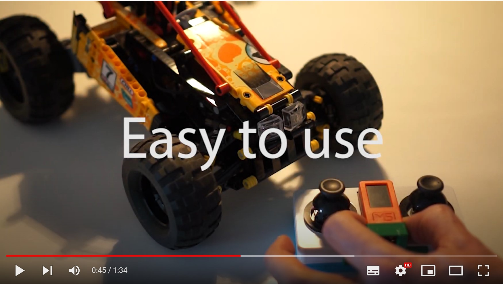

# M5StickC-JoyC-Lego-Control
The combination of M5StickCPlus & Joyc & Legoino library brings you an excellent experience for your Lego models by giving you the missing remote control for your control+ models.

# Configuration
Hardware:

* Printed 3D Case https://www.thingiverse.com/thing:4976935
* Controller by M5Stack https://m5stack.com/

* Joyc + M5StickCPlus + Case 

Software

* Install Arduino IDE and follow the official configuration on M5Stack site.
* Install the Legoino library from the library manager.
* Clone this repository
* Upload the code on your M5StickCPlus.

# PLAY

# Credits
* The idea goes back to Sebastien Colas. https://github.com/colas-sebastien/M5StickC-JoyC-lego-powerup-batmobile
* Many thanks to Legoino creator Cornelius Munz. https://github.com/corneliusmunz/legoino
* The JoyC Arduino Example code comes from Sorzn.
* Thank you Magnus for printing the 3D Case: https://www.thingiverse.com/spamalot/designs

Disclaimer: 
LEGO® is a trademark of the LEGO Group of companies which does not sponsor, authorize or endorse this project.
All Hardware to use this code is baught by myself and might need to be adapted if you change hardware.
